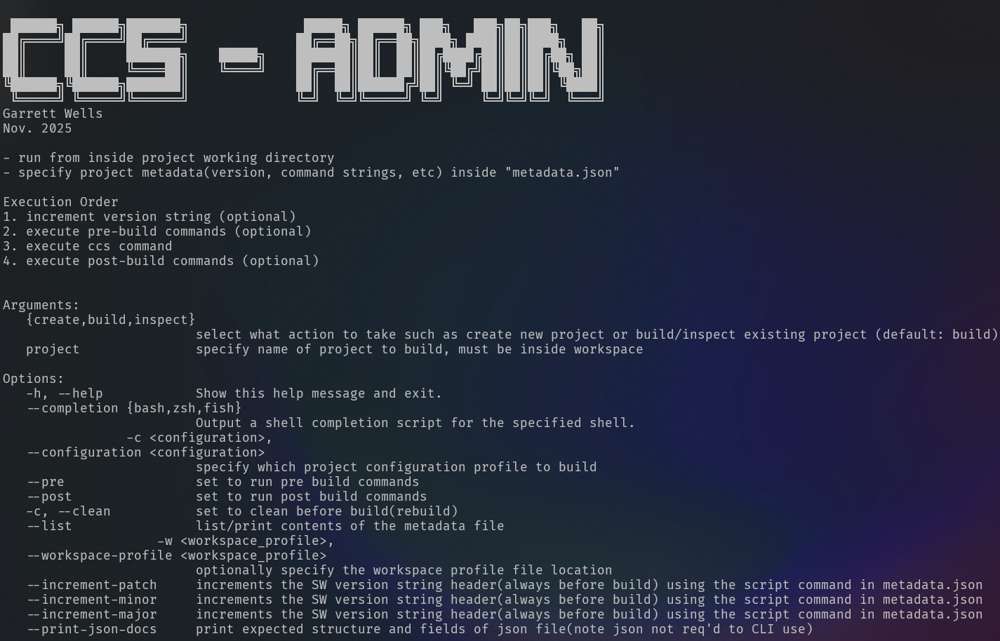

# CCS-Admin

Script for creating/building/inspecting CCStudio projects from the command line using Lua. 

Provides workflow automation by:

1. Allowing CCS project variables to be stored in `metadata.json`.
2. Providing the ability to execute pre/post build steps including:
    1. Semantic Version Control - the user can specify commands to be run to increment the semantic version to be used in a build (see [grwells/CSemantic-Version](github.com/grwells/CSemantic-Version) as an example).
    2. Pre-build Commands - ability to specify a list of string commands to be executed on the command line _before_ building (_ex._ generate headers, metadata, _etc._).
    3. Post-build Commands - the ability to specify list of commands to be executed _after_ building (_ex._ package/rename binaries).

3. Generally making everything **less verbose**.

# Installation

## 1/3 Install CCS-Admin Script

1. Copy to binary directory on path, for example: `cp ccs-admin.lua /usr/local/bin/ccs-admin`
2. Make a hard link to provide a shortcut if desired, ex.: `ln -i /usr/local/bin/ccs /usr/local/bin/ccs-admin`
3. Make sure the link is executable. `chmod +x /usr/local/bin/ccs`
4. Run to test. `ccs -h`

## 2/3 Generate Template `metadata.json` File and Customize

1. Run `ccs --json-template > metadata.json` to generate a JSON template with all supported fields.
2. Fill in values pertinent to your project.

## 3/3 Configure Your System/CCS

1. Make sure the CCS executable is on your path (add an export to your `.bashrc`).

    - CCSv12 - should be something like `~/ti/ccs1281/ccs/eclipse`
    - CCSv20 - try `~/ti/ccs2040/ccs/eclipse/`

2. Edit project `metadata.json` by setting `"ccs_version": <your-ccs-version>`. 

    - _**NOTE:** `<your-ccs-version>` should be just the major version, i.e. 12 or 20._
    - If nothing is specified, or an invalid value is specified, the script will default to the latest supported version (v20 probably).

# Example 

